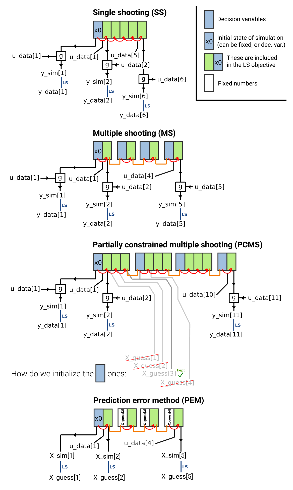

# nlgreyfast
## Toolbox for identification of nonlinear state-space grey-box models

This toolbox supports multiple formulations of the optimization problem for parameter estimation:



## Quick start 

The basic steps of identification using this toolbox:

1. Design, build an perform experiment for system identification. Measure plant input and output. 
2. Define the grey-box model of your system in CasADi, as a continuous or discrete time nonlinear state-space model.
3. Use `nlgreyfast` to estimate the model parameters.

First, install the dependencies:
- MATLAB (tested with R2019b on Ubuntu),
- CasADi (tested with version 3.5.5), available [here](https://web.casadi.org/get/).
- Optional: MathWorks System Identification Toolbox (if not available, you can still use the `nlidcomb` interface).
- Optional: MATLAB Coder

Second, go through the script `nlgreyfast_emps_example.m` step by step.  
For an example of the `nlidcomb` interface, see: `nlidcomb_msd_example`.  

## Credits

Authors of the code in this package:
- András Retzler
- Joris Gillis -- `nlgreyfast` is based on Joris' CasADi implementation of the MS and SS method.

## Acknowledgement

This research is supported by Flanders Make through ICON project ID2CON: Integrated IDentification for CONtrol, and by the Research Foundation - Flanders (FWO - Flanders) through project G0A6917N.

Special thanks to Alexandre Janot, Mathieu Brunot, Maxime Gautier for their EMPS model and measurement data:

> A. Janot, M. Gautier and M. Brunot, Data Set and Reference Models of EMPS, 2019 Workshop on Nonlinear System Identification Benchmarks, Eindhoven, The Netherlands, April 10-12, 2019.

The source of data in `nlid_emps_sim_data_training.mat` and part of the code related to EMPS is the package available [here](https://www.nonlinearbenchmark.org/benchmarks/emps).

## Cite

If you use this toolbox in your research, please cite:

```
TBD
```
